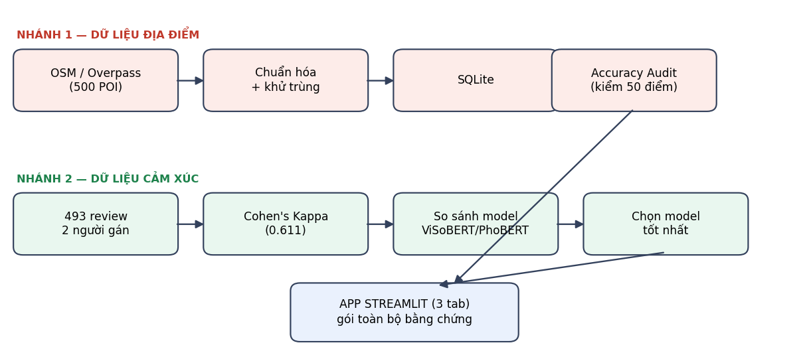
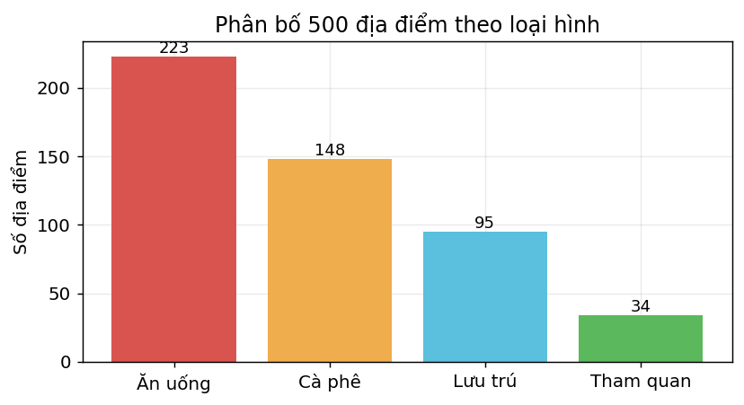
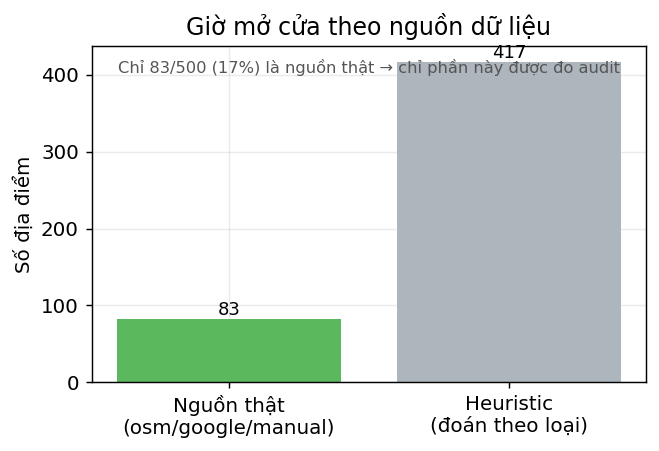
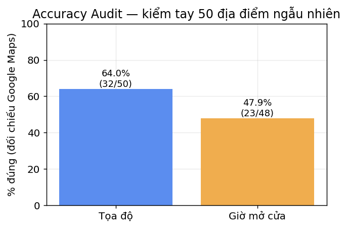
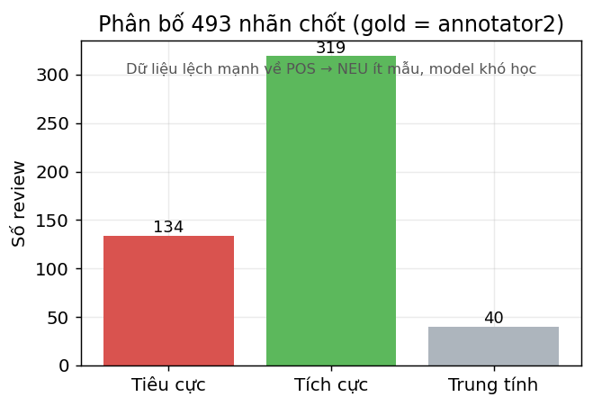
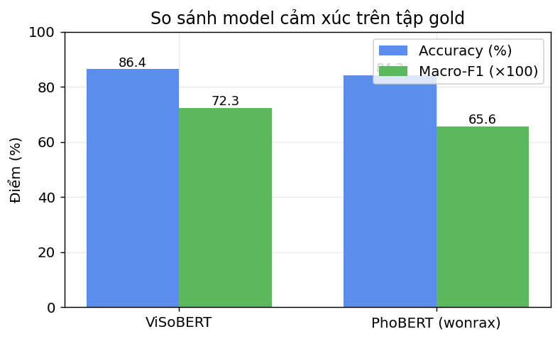
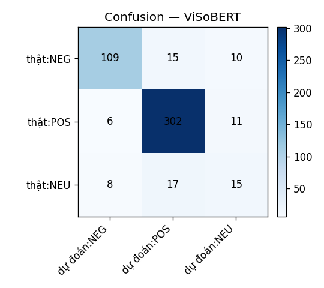
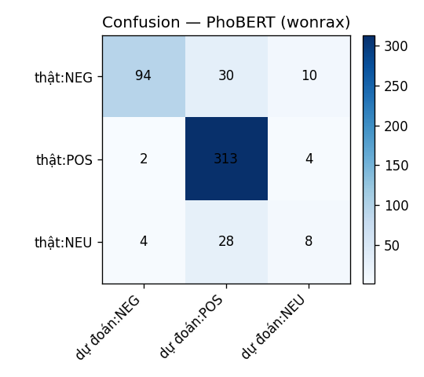

# BÁO CÁO DEMO — WiseTravel: Giải quyết bài toán dữ liệu cho ứng dụng du lịch

> **Loại:** Demo kỹ thuật (không phải sản phẩm hoàn chỉnh).
> **Phạm vi:** 12 quận nội thành Hà Nội · ~500 địa điểm.
> **Cập nhật:** 11/07/2026.

---

## Tóm tắt kết quả (một trang)

| Hạng mục | Kết quả | Ý nghĩa |
|---|---|---|
| Địa điểm thu thập | **500 POI** thật từ OpenStreetMap | Dữ liệu thật, không bịa |
| Accuracy audit — tọa độ | **64.0%** (32/50) | Tự đo được chất lượng, không nói suông |
| Accuracy audit — giờ mở cửa | **47.9%** (23/48) | Phát hiện giới hạn của dữ liệu mở |
| Độ đồng thuận gán nhãn (Cohen's Kappa) | **0.611** (substantial) | Tập gold đáng tin |
| Model cảm xúc tốt nhất | **ViSoBERT** — acc **86.4%**, macro-F1 **0.723** | Chọn model bằng bằng chứng |
| Sản phẩm demo | **App Streamlit 3 tab** | Gói toàn bộ bằng chứng |

---

## 1. Bài toán & mục tiêu

Một ứng dụng du lịch cần hai loại dữ liệu cốt lõi: **danh sách địa điểm** (ở đâu, mở cửa khi
nào, giá tầm nào) và **cảm nhận của người dùng** (địa điểm được khen hay chê). Cả hai đều là
"bài toán dữ liệu": thu thập thì dễ, nhưng **biết dữ liệu đúng hay sai** mới khó.

Đồ án chứng minh nhóm làm được **quy trình dữ liệu có kiểm chứng định lượng** cho cả hai loại,
thay vì thu thập rồi tin tưởng cảm tính.

## 2. Kiến trúc & quy trình

Hai nhánh dữ liệu độc lập, hội tụ vào một app trình diễn:

- **Công nghệ:** Python · SQLite · OpenStreetMap (Overpass, miễn phí) · model HuggingFace
  (không tự huấn luyện) · Streamlit.
- Toàn bộ chạy **local, tự chứa**, không cần dịch vụ trả phí.

---

## 3. Cách tổ chức dữ liệu

Dữ liệu được tổ chức thành **hai kho tách biệt** theo hai bài toán, cộng các file kiểm chứng.
Địa điểm lưu trong **SQLite** (một bảng `pois`, mỗi dòng một địa điểm, khóa chính là mã OSM);
dữ liệu cảm xúc lưu dạng **CSV phẳng** để hai người dễ cùng gán nhãn.

### 3.1 Địa điểm — bảng `pois` (SQLite)
Mỗi dòng là một địa điểm. Cột `hours_source` đánh dấu rõ nguồn của giờ mở cửa để tách dữ liệu
thật khỏi giá trị heuristic khi đo chất lượng.

| Trường | Kiểu | Ý nghĩa |
|---|---|---|
| `id` | TEXT (khóa chính) | Mã địa điểm từ OSM, vd `node/123`, `way/456` |
| `name` | TEXT | Tên địa điểm |
| `lat`, `lng` | REAL | Tọa độ vĩ độ / kinh độ |
| `category` | TEXT | `food` \| `cafe` \| `lodging` \| `attraction` |
| `subtype` | TEXT | Tag OSM gốc, vd `amenity=restaurant` |
| `district` | TEXT | Quận/phường từ tag `addr:*` (nếu có) |
| `address` | TEXT | Địa chỉ ghép từ tag `addr:*` của OSM |
| `address_google` | TEXT | Địa chỉ chuẩn từ Google (nếu làm giàu; hiện trống) |
| `opening_hours` | TEXT | Chuỗi giờ mở cửa kiểu OSM, vd `Mo-Su 08:00-22:00` |
| `hours_source` | TEXT | Nguồn giờ: `osm` \| `google` \| `heuristic` \| `manual` |
| `place_id` | TEXT | Google Place ID (nếu làm giàu) |
| `business_status` | TEXT | `OPERATIONAL` \| `CLOSED_TEMPORARILY` \| `CLOSED_PERMANENTLY` |
| `price_level` | INTEGER | Mức giá 1..3 |
| `price_level_estimated` | INTEGER | 1 = ước lượng heuristic, 0 = suy từ dữ liệu thật |
| `est_duration_min` | INTEGER | Thời lượng tham quan ước lượng (phút) |
| `source` | TEXT | Nguồn dữ liệu, vd `OpenStreetMap` |
| `last_updated` | TEXT | Ngày cập nhật (ISO) |

### 3.2 Cảm xúc — tập gold (CSV)
File `data/gold/gold.csv`, mỗi dòng một review với nhãn của hai người gán và nhãn chốt.

| Cột | Ý nghĩa |
|---|---|
| `id` | Số thứ tự review |
| `text` | Nội dung review tiếng Việt |
| `label` | Nhãn **chốt** làm chuẩn (= `annotator2`): POS \| NEG \| NEU |
| `annotator1` | Nhãn của người gán 1 (vòng rà soát) |
| `annotator2` | Nhãn của người gán 2 (người gán chính) |
| `source` | Nguồn review |

### 3.3 File kiểm chứng & kết quả

| Đường dẫn | Nội dung |
|---|---|
| `data/wisetravel.db` | SQLite — bảng `pois` (500 địa điểm) |
| `data/gold/gold.csv` | Tập gold cảm xúc (493 review đã gán) |
| `data/audit_sample.csv` | 50 địa điểm đã kiểm tay (`coord_dung`/`hours_dung`) |
| `reports/` | Kết quả sinh tự động: báo cáo, biểu đồ, ma trận nhầm lẫn |

> Nguyên tắc: dữ liệu thô + nhãn người gán giữ trong repo; báo cáo và biểu đồ trong `reports/`
> đều sinh lại được bằng script, đảm bảo **tái lập**.

## 4. Nhánh 1 — Dữ liệu địa điểm

### 4.1 Thu thập & chuẩn hóa
Lấy địa điểm thật từ OpenStreetMap qua Overpass API, gom về 4 loại hình, khử trùng lặp,
lưu vào SQLite. Kết quả 500 địa điểm:

### 4.2 Minh bạch nguồn giờ mở cửa
Không phải địa điểm nào OSM cũng có giờ mở cửa. Nhóm **ghi rõ nguồn** của từng giá trị
(`hours_source`): giá trị thật lấy từ OSM, phần thiếu điền bằng heuristic theo loại hình và
**đánh dấu rõ ràng** — không trộn lẫn để làm đẹp số liệu.

> Chỉ phần **nguồn thật** mới được đưa vào phép đo độ chính xác bên dưới.

### 4.3 Accuracy Audit — tự kiểm chứng
Nhóm rút ngẫu nhiên **50 địa điểm**, một người đối chiếu tay với Google Maps, chấm đúng/sai
cho tọa độ và giờ mở cửa:

**Nhận xét:** tọa độ 64% và giờ 48% nghe không cao, nhưng đây chính là **giá trị của đồ án**:
có công cụ *đo được* chất lượng dữ liệu mở, và trung thực chỉ ra giới hạn của nó. Ngoài ra còn
có bản đồ độ phủ tương tác `reports/coverage_map.html` (mở bằng trình duyệt) hiển thị cả 500 điểm
trên nền Hà Nội.

---

## 5. Nhánh 2 — Dữ liệu cảm xúc

### 5.1 Gán nhãn tập gold
Hai người gán nhãn **493 review tiếng Việt** thật vào 3 lớp POS / NEG / NEU. Nhãn chốt (`label`)
lấy theo **annotator2** (người gán chính; annotator1 là vòng rà soát).

> Dữ liệu **lệch mạnh về POS** (319/493). Đây là nguyên nhân trực tiếp khiến lớp NEU khó — mọi
> model đều ít mẫu NEU để học.

### 5.2 Độ đồng thuận — Cohen's Kappa
Đo mức đồng thuận giữa hai người gán trên 491 cặp hợp lệ:

> **Cohen's Kappa = 0.611** · đồng ý 78.8% · mức *substantial* (tốt) theo thang Landis–Koch.

Kappa cao chứng minh tập gold **đáng tin** để dùng làm chuẩn đánh giá model.

### 5.3 So sánh model cảm xúc
Chạy hai model tiếng Việt có sẵn trên HuggingFace lên tập gold, đo accuracy và macro-F1:

| Model | Accuracy | Macro-F1 |
|---|---:|---:|
| **ViSoBERT** (`5CD-AI/Vietnamese-Sentiment-visobert`) | **86.4%** | **0.723** |
| PhoBERT (`wonrax/phobert-base-vietnamese-sentiment`) | 84.2% | 0.656 |

**Kết luận: chọn ViSoBERT** — thắng ở macro-F1, và không cần tách từ nên giữ nguyên
teencode/emoji vốn hay xuất hiện trong review.

### 5.4 Ma trận nhầm lẫn
Chi tiết model đúng/sai ở từng lớp:

| ViSoBERT | PhoBERT |
|---|---|
|  |  |

**Nhận xét:** cả hai đọc tốt POS và NEG nhưng **yếu ở NEU** (ViSoBERT F1≈0.40, PhoBERT≈0.26) —
đúng như dự đoán từ dữ liệu lệch ở mục 5.1. Đây là hạn chế nhóm hiểu rõ, không giấu.

---

## 6. Sản phẩm demo — App Streamlit

Toàn bộ bằng chứng được gói vào một app 3 tab (`streamlit run app.py`):

1. **📍 Dữ liệu địa điểm & Chất lượng** — tổng quan 500 POI, giờ theo nguồn, accuracy audit,
   bản đồ độ phủ, ô tra cứu địa điểm.
2. **🏷️ Gán nhãn & So sánh model** — phân bố nhãn, Cohen's Kappa, bảng so sánh model, ma trận
   nhầm lẫn.
3. **💬 Demo cảm xúc** — nhập nhiều review → model chấm nhãn từng câu + tỷ lệ pos/neg/neu cho
   địa điểm (đúng cách kết quả được dùng trong app du lịch thật).

---

## 7. Hạn chế & hướng phát triển

| Hạn chế (trung thực) | Hướng khắc phục |
|---|---|
| Giờ mở cửa thật chỉ phủ 17% (OSM thiếu) | Bổ sung nguồn Google Places (đã có code, hiện bị chặn ở cấp tổ chức) |
| Tọa độ/giờ audit 64%/48% | Lọc thêm bằng nhiều nguồn, cập nhật định kỳ |
| NEU yếu do dữ liệu lệch (chỉ 40 mẫu) | Gán thêm review NEU để cân bằng tập gold |
| Chưa có tính năng lập lộ trình | Phase 3 (tùy chọn): thuật toán TSP có khung giờ |

## 8. Kết luận

Đồ án chứng minh nhóm làm chủ **quy trình dữ liệu có kiểm chứng** cho cả địa điểm và cảm xúc:
thu thập dữ liệu thật → **đo được chất lượng** (audit 64%/48%) → gán nhãn **đáng tin**
(Kappa 0.611) → **chọn model bằng bằng chứng** (ViSoBERT 86.4%) → đóng gói thành app trình diễn.
Điểm mạnh xuyên suốt là **tính minh bạch và định lượng** — nêu rõ cả điểm mạnh lẫn giới hạn.

---

*Phụ lục — tái tạo mọi biểu đồ trong báo cáo:* `python scripts/make_report_figures.py`
(đọc trực tiếp từ SQLite + tập gold + kết quả model, ghi ra `reports/figures/`).
